# TestFrameworkAzure — arc42 Architecture Documentation

> **Version:** 1.1
> **Date:** April 2026
> **Audience:** Developers writing Azure integration tests with the TestFramework

---

## Table of Contents

1. [Introduction and Goals](#1-introduction-and-goals)
2. [Constraints](#2-constraints)
3. [System Scope and Context](#3-system-scope-and-context)
4. [Solution Strategy](#4-solution-strategy)
5. [Building Block View](#5-building-block-view)
6. [Runtime View](#6-runtime-view)
7. [Deployment View](#7-deployment-view)
8. [Cross-Cutting Concepts](#8-cross-cutting-concepts)
9. [Architecture Decisions](#9-architecture-decisions)
10. [Quality Requirements](#10-quality-requirements)
11. [Risks and Technical Debt](#11-risks-and-technical-debt)
12. [Glossary](#12-glossary)
13. [Quickstart](#13-quickstart)

---

## 1. Introduction and Goals

### 1.1 Purpose

**TestFrameworkAzure** is the Azure extension package for TestFrameworkCore. It provides ready-to-use implementations for:

- **Triggers** — Azure Functions (HTTP, Managed, InProcess), sending Service Bus messages
- **Artifacts** — Blob Storage, Table Storage, Cosmos DB, SQL Server (EF Core) — automatic setup, versioning, and teardown
- **Events** — Receiving Service Bus messages (with temporary subscriptions)
- **Configuration** — Central management of connection strings and service settings via typed identifiers

**Core goal:** A team member can write a complete Azure integration test — from configuration to assertion — using only this documentation.

### 1.2 Quality Goals

| Priority | Goal | Description |
|----------|------|-------------|
| 1 | **Full Azure coverage** | Blob, Table, Cosmos, SQL, ServiceBus, FunctionApp as first-class citizens |
| 2 | **Fluent API** | `AzureTF.Trigger.FunctionApp.Http(…)` — readable, type-safe, IDE-friendly |
| 3 | **Automatic lifecycle** | Artifacts are automatically torn down after the test |
| 4 | **Identifier-based config** | Multiple instances of the same service type can be configured in parallel |
| 5 | **Isolation** | Service Bus tests use temporary subscriptions with server-side filtering |

### 1.3 Stakeholders

| Role | Expectation |
|------|-------------|
| Test developer | Simple API for Azure step definition and assertion |
| DevOps / Infra | Clear configuration structure (JSON sections, connection strings) |
| Framework developer | Extensible patterns for new Azure services |

---

## 2. Constraints

### 2.1 Technical

| Constraint | Detail |
|------------|--------|
| Runtime | .NET 8.0 |
| Azure Functions | Isolated Worker Model (dotnet-isolated) |
| ORM | Entity Framework Core 8.0 (SQL Server provider) |
| Configuration | Microsoft.Extensions.Configuration + DependencyInjection v10.0 |
| Azure SDKs | Azure.Storage.Blobs 12.26, Azure.Data.Tables 12.9, Azure.Messaging.ServiceBus 7.20, Microsoft.Azure.Cosmos 3.57 |

### 2.2 Organisational

| Constraint | Detail |
|------------|--------|
| Dependency | Builds on `TestFrameworkCore` (engine) and `TestFrameworkConfig` (configuration) |
| Config source | JSON file (e.g. `local.testSettings.json`) with sections per Azure service |
| Azure resources | Must be pre-provisioned — the framework does not create infrastructure |

---

## 3. System Scope and Context

### 3.1 Business Context

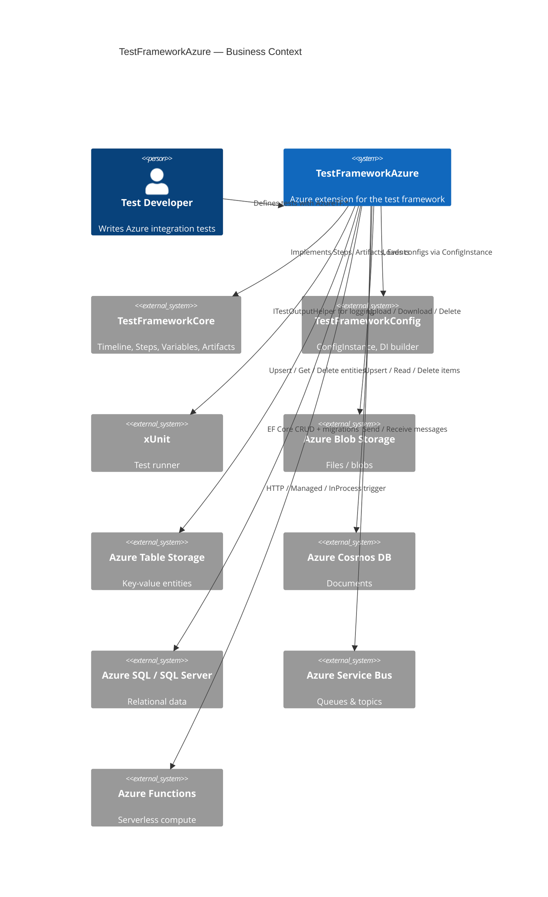

### 3.2 Technical Context — Dependencies

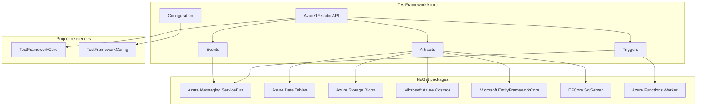

---

## 4. Solution Strategy

| Decision | Rationale |
|----------|-----------|
| **Static entry-point `AzureTF`** | Single discoverable API surface — `AzureTF.Trigger.*`, `AzureTF.Artifact.*`, etc. |
| **Identifier pattern** | Each Azure service instance is addressed by an identifier → multiple instances in parallel |
| **Artifact triple (Reference/Data/Describer)** | Reuses the Core CRTP pattern per Azure service |
| **Staged builder for Function App HTTP** | Interface-based stages prevent incomplete configurations |
| **Service Bus temp subscriptions** | Test isolation via per-run subscriptions with server-side correlation filters |
| **SQL: DbContext registry + 3-tier resolution** | Flexible Identifier → DbContext mapping without requiring compile-time binding |

---

## 5. Building Block View

### 5.1 Level 1 — Overview

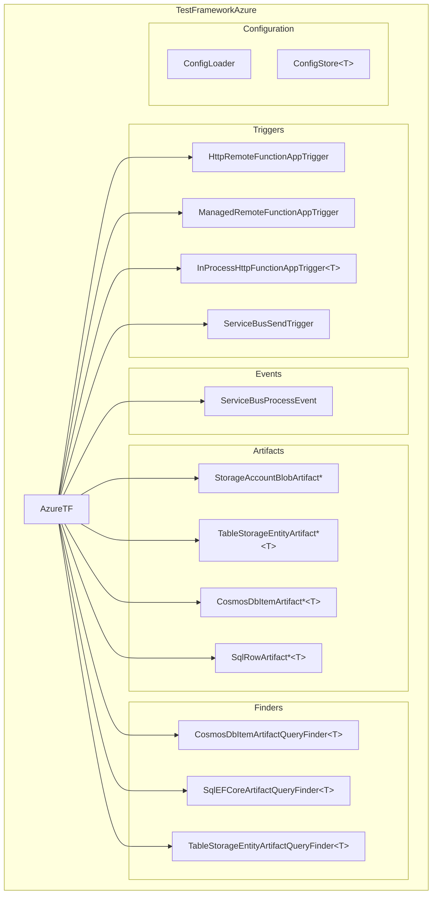

### 5.2 AzureTF — Static API Structure

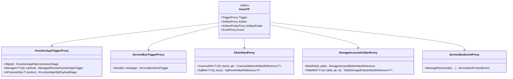

### 5.3 Artifact Implementations per Azure Service

```mermaid
classDiagram
    class ArtifactReferenceGeneric {<<abstract / Core>>}
    class ArtifactDataGeneric {<<abstract / Core>>}
    class ArtifactDescriberGeneric {<<abstract / Core>>}

    class StorageAccountBlobArtifactReference {
        +StorageAccountIdentifier Identifier
        +VariableReference~string~ Path
        +ResolveToDataAsync() download blob
    }
    class StorageAccountBlobArtifactData {
        +byte[] Data
        +IDictionary Metadata
    }
    class StorageAccountBlobArtifactDescriber {
        +Setup() upload blob
        +Deconstruct() delete blob
    }

    class TableStorageEntityArtifactReference~T~ {
        +StorageAccountIdentifier Identifier
        +VariableReference~string~ TableName, PartitionKey, RowKey
        +ResolveToDataAsync() GetEntity
    }
    class TableStorageEntityArtifactData~T~ { +T Entity }
    class TableStorageEntityArtifactDescriber~T~ {
        +Setup() UpsertEntity
        +Deconstruct() DeleteEntity
    }

    class CosmosDbItemArtifactReference~T~ {
        +CosmosContainerIdentifier Identifier
        +string Id, PartitionKey
        +ResolveToDataAsync() ReadItemStream
    }
    class CosmosDbItemArtifactData~T~ { +T Item }
    class CosmosDbItemArtifactDescriber~T~ {
        +Setup() UpsertItemAsync
        +Deconstruct() DeleteItemAsync
    }

    class SqlRowArtifactReference~T~ {
        +SqlDatabaseIdentifier Identifier
        +string[] PrimaryKeyValues
        +ResolveToDataAsync() FindAsync via EF Core
    }
    class SqlRowArtifactData~T~ { +T Row }
    class SqlRowArtifactDescriber~T~ {
        +Setup() Add/Update + SaveChangesAsync
        +Deconstruct() Remove + SaveChangesAsync
    }

    ArtifactReferenceGeneric <|-- StorageAccountBlobArtifactReference
    ArtifactReferenceGeneric <|-- TableStorageEntityArtifactReference~T~
    ArtifactReferenceGeneric <|-- CosmosDbItemArtifactReference~T~
    ArtifactReferenceGeneric <|-- SqlRowArtifactReference~T~
    ArtifactDataGeneric <|-- StorageAccountBlobArtifactData
    ArtifactDataGeneric <|-- TableStorageEntityArtifactData~T~
    ArtifactDataGeneric <|-- CosmosDbItemArtifactData~T~
    ArtifactDataGeneric <|-- SqlRowArtifactData~T~
    ArtifactDescriberGeneric <|-- StorageAccountBlobArtifactDescriber
    ArtifactDescriberGeneric <|-- TableStorageEntityArtifactDescriber~T~
    ArtifactDescriberGeneric <|-- CosmosDbItemArtifactDescriber~T~
    ArtifactDescriberGeneric <|-- SqlRowArtifactDescriber~T~
```

### 5.4 Function App Trigger — Three Modes

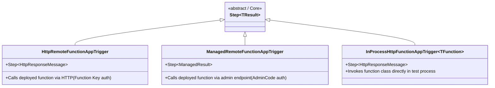

### 5.5 Service Bus — Trigger + Event + Temp Subscription

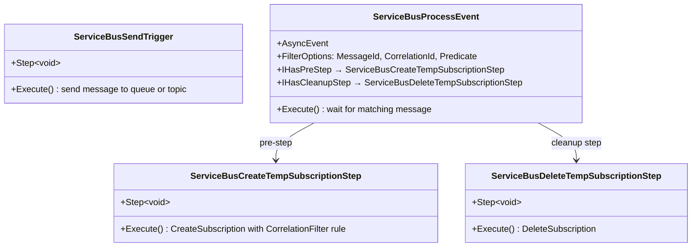

### 5.6 Configuration System

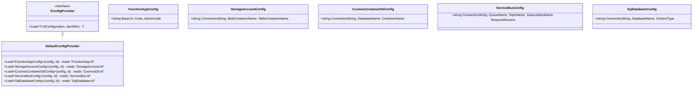

### 5.7 SQL Server — DbContext Resolution

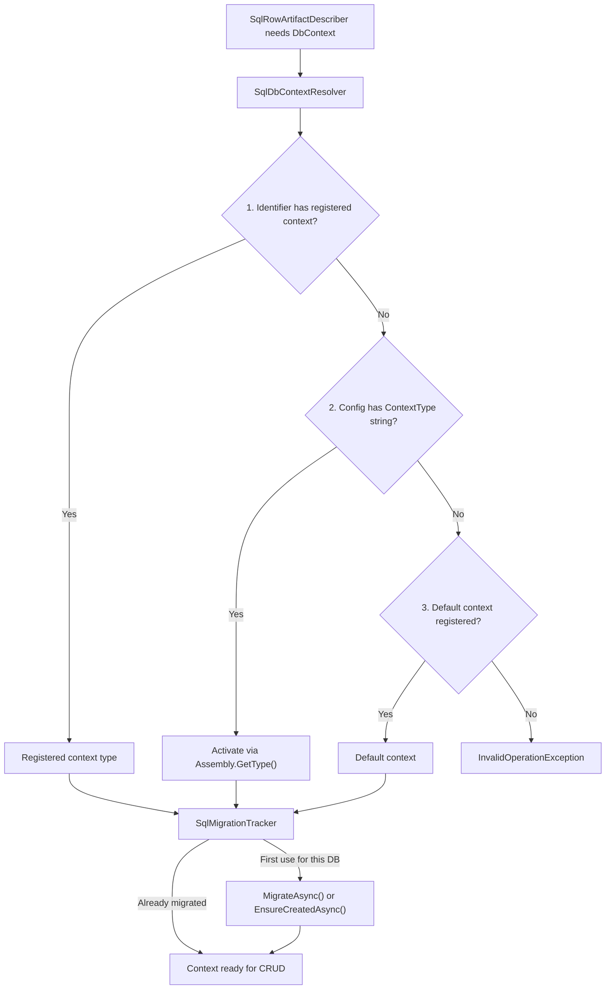

---

## 6. Runtime View

### 6.1 Scenario: Blob Upload → Function Trigger → Cosmos Assert

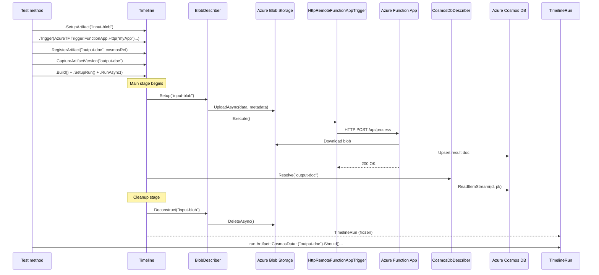

### 6.2 Scenario: Service Bus Send + Receive with Temp Subscription

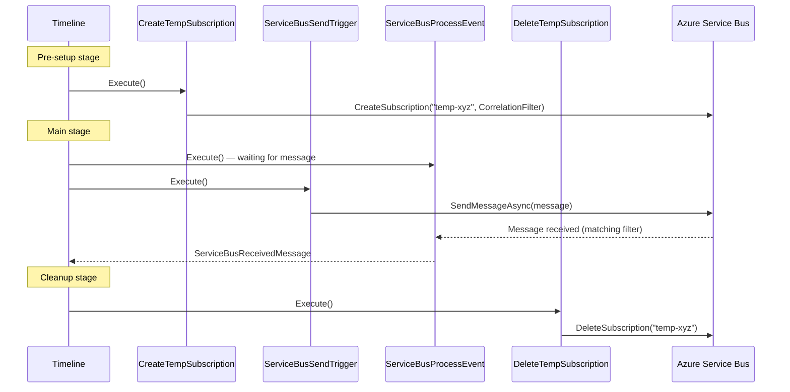

### 6.3 Scenario: InProcess Function App Test

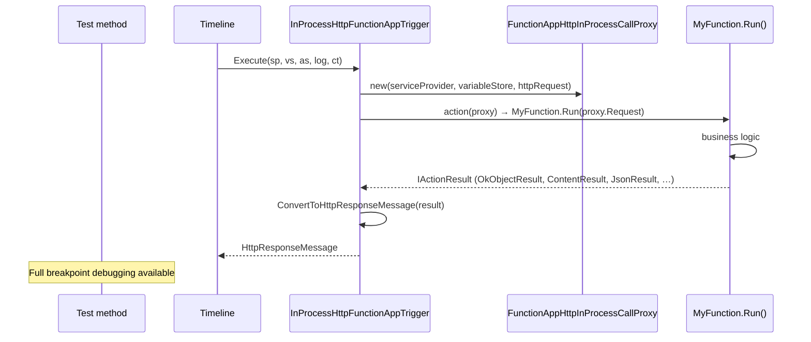

### 6.4 Scenario: Loading Configuration

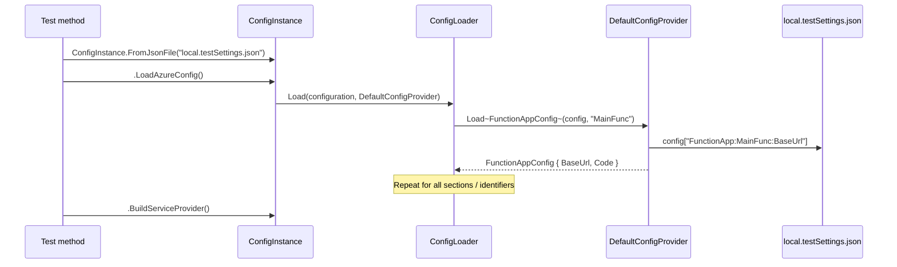

---

## 7. Deployment View

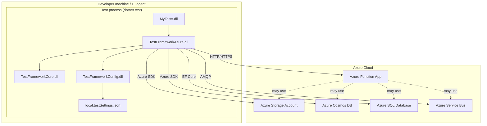

---

## 8. Cross-Cutting Concepts

### 8.1 Identifier Pattern

Every Azure service is addressed by a **strongly typed identifier** with implicit string conversion:

```csharp
public record StorageAccountIdentifier(string Identifier)
{
    public static implicit operator string(StorageAccountIdentifier id) => id.Identifier;
    public static implicit operator StorageAccountIdentifier(string id) => new(id);
}
```

**JSON configuration (`local.testSettings.json`):**

```json
{
  "StorageAccount": {
    "MainStorage": {
      "ConnectionString": "UseDevelopmentStorage=true",
      "BlobContainerName": "test-blobs",
      "TableContainerName": "test-tables"
    }
  },
  "FunctionApp": {
    "MainFunc": {
      "BaseUrl": "https://my-func.azurewebsites.net",
      "Code": "function-key",
      "AdminCode": "admin-master-key"
    }
  },
  "CosmosDb": {
    "MainDb": {
      "ConnectionString": "AccountEndpoint=...;AccountKey=...",
      "DatabaseName": "TestDb",
      "ContainerName": "Items"
    }
  },
  "ServiceBus": {
    "MainSBTopic": {
      "ConnectionString": "Endpoint=sb://...;SharedAccessKey=...",
      "TopicName":  "test-topic",
      "SubscriptionName": "test-sub"
    }
  },
  "SqlDatabase": {
    "MainSql": {
      "ConnectionString": "Server=...;Database=...;",
      "DatabaseName": "TestDb"
    }
  }
}
```

### 8.2 Artifact Lifecycle per Azure Service

| Service | Setup (Describer) | Resolve (Reference) | Deconstruct (Describer) |
|---------|-------------------|---------------------|------------------------|
| **Blob Storage** | `BlobClient.UploadAsync` | `DownloadContentAsync` | `DeleteAsync` |
| **Table Storage** | `TableClient.UpsertEntityAsync` | `GetEntityAsync(pk, rk)` | `DeleteEntityAsync` |
| **Cosmos DB** | `Container.UpsertItemAsync` | `ReadItemStreamAsync(id, pk)` | `DeleteItemAsync(id, pk)` |
| **SQL Server** | `DbContext.Add/Update` + `SaveChangesAsync` | `FindAsync(keys)` | `Remove` + `SaveChangesAsync` |

### 8.3 Function App — Three Trigger Modes Compared

| Aspect | Remote HTTP | Managed | InProcess |
|--------|-------------|---------|-----------|
| **Target** | Deployed function via HTTP | Deployed function via admin API | Function class in test process |
| **Auth** | Function Key (`Code`) | Admin Master Key (`AdminCode`) | None (direct call) |
| **Return** | `HttpResponseMessage` | `ManagedResult` | `HttpResponseMessage` |
| **Ping check** | Optional | Optional | Not needed |
| **Debugging** | Not possible | Not possible | Full breakpoint debugging |
| **Prerequisite** | Deployed + online | Deployed + online + AdminCode | Project reference to FunctionApp |
| **Builder** | `AzureTF.Trigger.FunctionApp.Http(id)` | `AzureTF.Trigger.FunctionApp.Managed<T>(id, method)` | `AzureTF.Trigger.FunctionApp.InProcessHttp<T>(action)` |

### 8.4 Supported IActionResult Types (InProcess)

`ConvertToHttpResponseMessage` handles:

| IActionResult type | Behaviour |
|-------------------|-----------|
| `null` | 200 OK, empty body |
| `ObjectResult` (incl. `OkObjectResult`, `BadRequestObjectResult`, …) | Status from `StatusCode`, body from `obj.Value.ToString()` |
| `ContentResult` | Status, body, and `ContentType` preserved |
| `JsonResult` | Status + JSON-serialised `Value` (`application/json`) |
| `StatusCodeResult` (incl. `OkResult`, `NoContentResult`, …) | Status, no body |
| Any other type | `NotSupportedException` with clear message |

### 8.5 Service Bus Temp Subscription Lifecycle

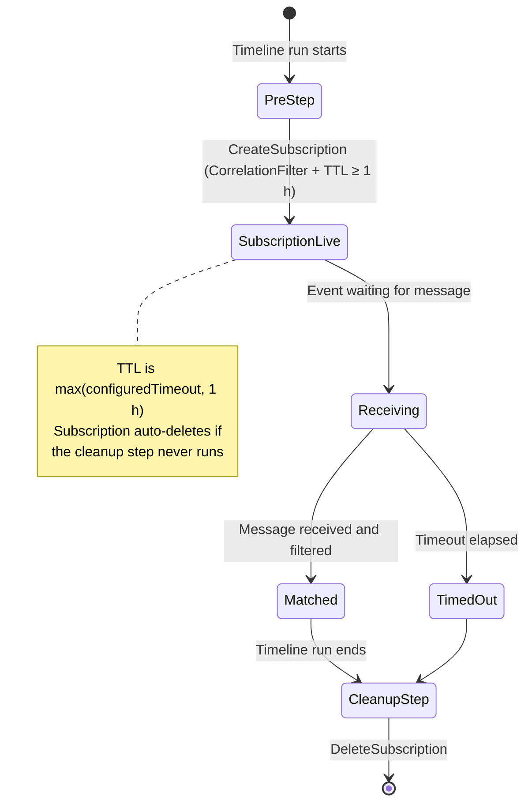

### 8.6 SQL Migration Tracking

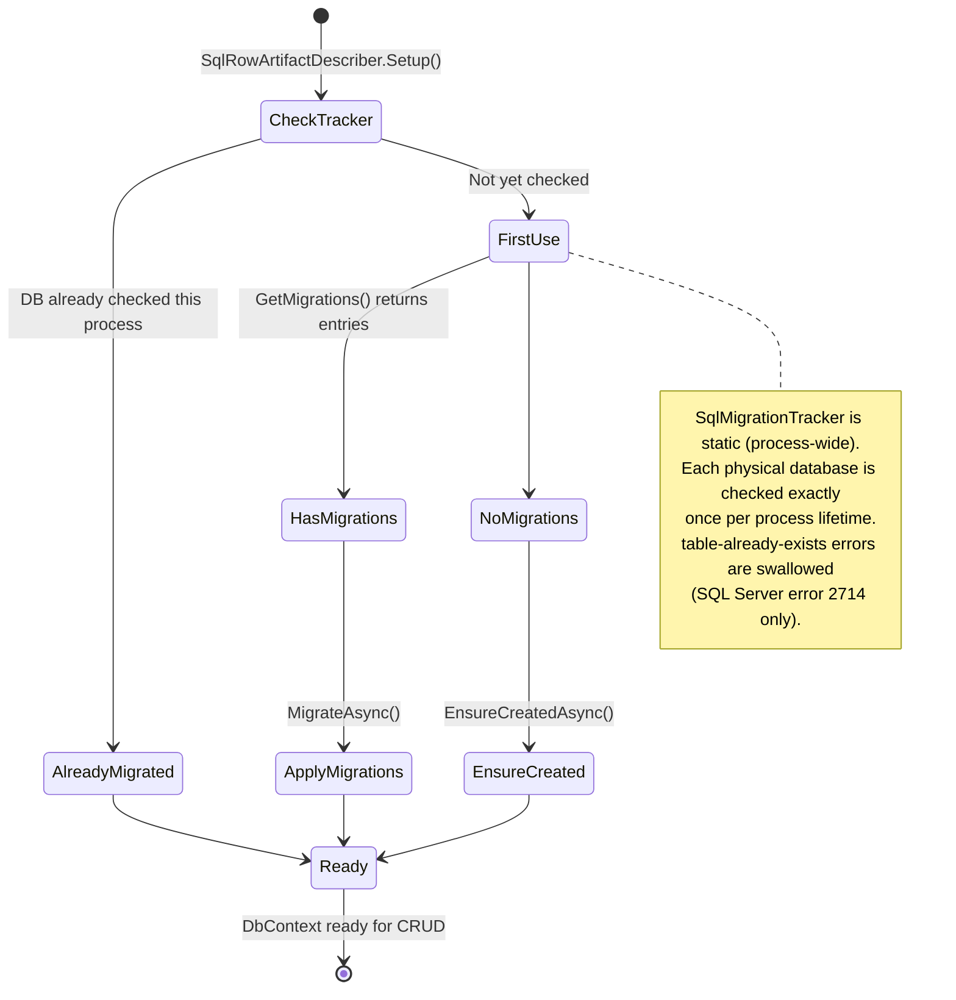

---

## 9. Architecture Decisions

### ADR-1: Static Entry-Point Class Instead of Extension Methods

**Context:** The Azure API must be easy to discover without needing to know which extension methods exist.

**Decision:** `AzureTF` as a static class with nested proxy classes.

**Consequence:** Auto-complete immediately shows `AzureTF.Trigger.*`, `AzureTF.Artifact.*`, etc. Trade-off: not extensible by third parties without modifying the class.

### ADR-2: VariableReference for Dynamic Artifact Identifiers

**Context:** Artifact references (e.g. blob path, table row key) must be resolvable from variables at runtime.

**Decision:** `ArtifactReference` constructors accept `VariableReference<string>` instead of `string`.

**Consequence:** `Var.Const("fixed-path")` for static tests, `Var.Ref<string>("dynamicPath")` for parametrised tests. Artifacts can be named dynamically inside `ForEach` loops.

### ADR-3: 3-Tier SQL DbContext Resolution

**Context:** A test may use multiple SQL databases with different schemas. Identifier → DbContext mapping must be flexible.

**Decision:** 3-tier lookup: (1) explicit registry entries → (2) CLR type name from config → (3) default context.

**Consequence:** Simple tests need only a default context; complex tests can register a context per identifier.

### ADR-4: Pre/Cleanup Steps for Service Bus Subscriptions

**Context:** Temporary subscriptions must be created before a message arrives and deleted afterwards.

**Decision:** `ServiceBusProcessEvent` implements `IHasPreStep` and `IHasCleanupStep`. Core's preprocessor automatically inserts these steps into the pre-setup and cleanup stages.

**Consequence:** Test developers don't manage subscription lifecycle — it's handled automatically.

### ADR-5: InProcess Trigger via Proxy Pattern

**Context:** InProcess tests need access to DI services and variables without starting the Azure Functions host.

**Decision:** `FunctionAppHttpInProcessCallProxy` provides `HttpRequest`, `GetService()`, and `GetVariable()`. The function class is instantiated directly.

**Consequence:** Full debugging support; only HTTP triggers are currently supported in-process. Timer InProcess is also available.

---

## 10. Quality Requirements

### 10.1 Quality Tree

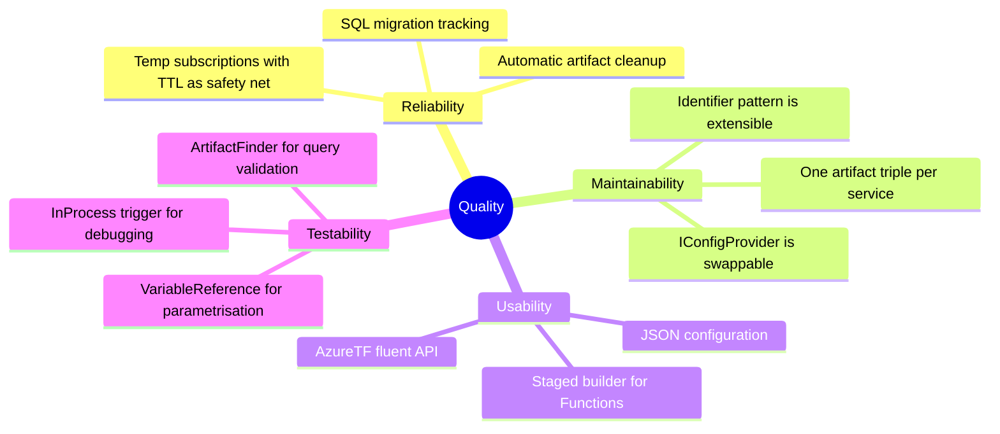

### 10.2 Quality Scenarios

| Scenario | Goal | Expected behaviour |
|----------|------|--------------------|
| Write new Cosmos test | Usability | `AzureTF.Artifact.DB.CosmosRef<T>(…)` returns type-safe ref; describer handles upsert/delete |
| Test blob not cleaned up | Reliability | Cleanup stage calls `BlobClient.DeleteAsync()` for every artifact that was set up |
| Add new SQL database | Maintainability | Only add a config section entry; optionally register a DbContext |
| Service Bus test interferes | Testability | Temp subscription with CorrelationId filter isolates the test |
| Function App offline | Reliability | Ping fails → `FunctionAppPingException` with clear message |
| InProcess debugging needed | Testability | `InProcessHttp<T>` allows breakpoints inside function logic |

---

## 11. Risks and Technical Debt

| # | Risk / Debt | Impact | Mitigation |
|---|------------|--------|-----------|
| 1 | **SQL type conversion uses `Convert.ChangeType`** for composite PK values | May fail for non-standard types | Validated against EF Core key types; add guards with informative errors if needed |
| 2 | **Cosmos default resolver uses reflection** (searches for "id"/"partitionKey" properties case-insensitively) | Silent failure if domain model uses non-standard naming | Implement `ICosmosDbIdentifierResolver` to override; document naming convention |
| 3 | **InProcess `IActionResult` limited to 4 types** | Other result types (Redirect, File, …) throw `NotSupportedException` | Add further types on demand |
| 4 | **Service Bus TTL = max(timeout, 1 h)** | Subscription lives up to 1 h even if timeout is shorter | Intentional safety net; auto-delete on idle also set to 2×TTL |
| 5 | **No Queue artifact** for Storage Account | Only Blob and Table covered | Implement as a new artifact triple when needed |
| 6 | **No Event Hub / Event Grid integration** | Only Service Bus covered | Implement as a new artifact triple / async event when needed |

---

## 12. Glossary

| Term | Definition |
|------|-----------|
| **AzureTF** | Static entry-point class for all Azure operations |
| **Identifier** | Strongly typed name for an Azure service instance (e.g. `"MainStorage"`) — maps to a JSON config section |
| **ConfigStore\<T\>** | Dictionary of configs for one service type, keyed by identifier |
| **Trigger** | Step that initiates an action in Azure (Function HTTP call, send Service Bus message) |
| **Artifact** | Managed data object in Azure — automatic setup (create) and deconstruct (delete) |
| **ArtifactFinder** | Query logic for finding artifacts (Cosmos SQL, EF Core LINQ, OData filter) |
| **Event** | Step that waits for an asynchronous external event (e.g. receive Service Bus message) |
| **Temp Subscription** | One-off Service Bus topic subscription with server-side filter, auto-deleted after test |
| **InProcess trigger** | Function invocation directly in the test process — no deployment needed, full debugging |
| **Managed trigger** | Function invocation via admin endpoint (POST /admin/functions/{name}) |
| **Remote HTTP trigger** | Function invocation via the normal HTTP endpoint with a function key |
| **DbContext Registry** | Maps `SqlDatabaseIdentifier` → EF Core `DbContext` type |
| **MigrationTracker** | Process-wide static tracker ensuring each database is migrated exactly once |
| **CRTP** | Curiously Recurring Template Pattern — from Core, enforces type-safe artifact triples |
| **ManagedResult** | Return type of `ManagedRemoteFunctionAppTrigger`: `StatusCode` + `Body` |

---

## 13. Quickstart

### 13.1 Prerequisites

**Project references** in your test project:

```xml
<ProjectReference Include="..\TestFrameworkCore\TestFrameworkCore.csproj" />
<ProjectReference Include="..\TestFrameworkAzure\TestFrameworkAzure.csproj" />
<ProjectReference Include="..\TestFrameworkConfig\TestFrameworkConfig.csproj" />
```

**`local.testSettings.json`** (set as Content / Copy to Output):

```json
{
  "StorageAccount": {
    "MainStorage": {
      "ConnectionString": "UseDevelopmentStorage=true",
      "BlobContainerName": "test-blobs",
      "TableContainerName": "test-tables"
    }
  },
  "FunctionApp": {
    "MainFunc": {
      "BaseUrl": "http://localhost:7071",
      "Code": ""
    }
  },
  "CosmosDb": {
    "MainDb": {
      "ConnectionString": "AccountEndpoint=https://localhost:8081;AccountKey=...",
      "DatabaseName": "TestDb",
      "ContainerName": "Items"
    }
  },
  "ServiceBus": {
    "MainSBTopic": {
      "ConnectionString": "Endpoint=sb://...;SharedAccessKeyName=...;SharedAccessKey=...",
      "TopicName": "test-topic",
      "SubscriptionName": "test-sub"
    }
  },
  "SqlDatabase": {
    "MainSql": {
      "ConnectionString": "Server=localhost;Database=TestDb;Trusted_Connection=true;",
      "DatabaseName": "TestDb"
    }
  }
}
```

Azure resources must exist before running tests (Storage Account, Service Bus Namespace, Cosmos DB, SQL DB, Function App).

### 13.2 Load Configuration

```csharp
using TestFramework.Config;
using TestFrameworkAzure.Extensions;

var serviceProvider = ConfigInstance
    .FromJsonFile("local.testSettings.json")
    .LoadAzureConfig()
    .BuildServiceProvider();
```

### 13.3 Blob Upload Test

```csharp
[Fact]
public async Task Blob_Upload_And_Verify()
{
    var blobRef  = AzureTF.Artifact.StorageAccount.BlobRef("MainStorage", Var.Const("test/sample.json"));
    var blobData = new StorageAccountBlobArtifactData(
        Encoding.UTF8.GetBytes("{\"key\": \"value\"}"),
        new Dictionary<string, string> { ["version"] = "1.0" });

    var timeline = Timeline.Create("BlobTest")
        .SetupArtifact("testBlob")
        .CaptureArtifactVersion("testBlob")
        .Build();

    var run = await timeline
        .SetupRun(serviceProvider, _output)
        .AddArtifact("testBlob", blobRef, blobData)
        .RunAsync();

    run.EnsureRanToCompletion();
    run.Artifact<StorageAccountBlobArtifactData>("testBlob").Should().HaveBeenSetUp();
}
```

### 13.4 Function App HTTP Trigger

```csharp
[Fact]
public async Task Function_HTTP_Trigger()
{
    var trigger = AzureTF.Trigger.FunctionApp.Http("MainFunc")
        .SelectEndpoint("/api/process", HttpMethod.Post)
        .WithBody("{\"input\": \"test\"}")
        .Call();

    var timeline = Timeline.Create("FuncTest")
        .Trigger(trigger)
            .WithTimeOut(TimeSpan.FromSeconds(60))
            .WithRetry(2, CalcDelays.Linear(TimeSpan.FromSeconds(3)))
        .Build();

    var run = await timeline.SetupRun(serviceProvider, _output).RunAsync();
    run.EnsureRanToCompletion();
}
```

### 13.5 Service Bus Send + Receive

```csharp
[Fact]
public async Task ServiceBus_Send_Receive()
{
    var correlationId = Guid.NewGuid().ToString();

    var timeline = Timeline.Create("SBTest")
        .WaitForEvent(AzureTF.Event.ServiceBus.MessageReceived(
            "MainSBTopic",
            correlationId: correlationId,
            createTempSubscription: true,
            completeMessage: true))
            .WithTimeOut(TimeSpan.FromMinutes(2))
        .Trigger(AzureTF.Trigger.ServiceBus.Send("MainSBTopic",
            new ServiceBusMessage("payload") { CorrelationId = correlationId }))
        .Build();

    var run = await timeline.SetupRun(serviceProvider, _output).RunAsync();
    run.EnsureRanToCompletion();
}
```

### 13.6 Cosmos DB Artifact

```csharp
public record MyItem(string id, string partitionKey, string Name);

[Fact]
public async Task Cosmos_Item_Lifecycle()
{
    var itemId    = Guid.NewGuid().ToString();
    var cosmosRef = AzureTF.Artifact.DB.CosmosRef<MyItem>("MainDb", itemId, itemId);
    var cosmosData = new CosmosDbItemArtifactData<MyItem>(new MyItem(itemId, itemId, "TestItem"));

    var timeline = Timeline.Create("CosmosTest")
        .SetupArtifact("myDoc")
        .CaptureArtifactVersion("myDoc")
        .Build();

    var run = await timeline
        .SetupRun(serviceProvider, _output)
        .AddArtifact("myDoc", cosmosRef, cosmosData)
        .RunAsync();

    run.EnsureRanToCompletion();
    // Item is automatically upserted on setup and deleted in cleanup
}
```

### 13.7 SQL Server with EF Core

```csharp
// 1. Register DbContext once (e.g. in test fixture)
services.AddSqlArtifactContexts(registry =>
{
    registry.RegisterDefault<TestDbContext>();
    // or: registry.Register("MainSql", typeof(TestDbContext));
});

// 2. Use in a test
var sqlRef  = AzureTF.Artifact.DB.SqlRef<OrderEntity>("MainSql", orderId.ToString());
var sqlData = new SqlRowArtifactData<OrderEntity>(new OrderEntity { Id = orderId, Name = "TestOrder" });

var timeline = Timeline.Create("SqlTest")
    .SetupArtifact("order")
    .Trigger(myBusinessStep)
    .CaptureArtifactVersion("order")
    .Build();
```

### 13.8 InProcess Function App (Local Debugging)

```csharp
// Requires a project reference to the FunctionApp project

[Fact]
public async Task Function_InProcess_Debug()
{
    var trigger = AzureTF.Trigger.FunctionApp
        .InProcessHttp<MyFunction>(async proxy =>
        {
            var func = new MyFunction(proxy.GetService<IMyService>()!);
            return await func.Run(proxy.Request);
        });

    var timeline = Timeline.Create("InProcessTest")
        .Trigger(trigger).WithTimeOut(TimeSpan.FromSeconds(30))
        .Build();

    var run = await timeline.SetupRun(serviceProvider, _output).RunAsync();
    run.EnsureRanToCompletion();
}
```

### 13.9 End-to-End Test (Blob → Function → Cosmos)

```csharp
[Fact]
public async Task E2E_Blob_Function_Cosmos()
{
    var blobPath = $"input/{Guid.NewGuid()}.json";

    var timeline = Timeline.Create("E2E")
        .SetupArtifact("inputBlob")
        .Trigger(AzureTF.Trigger.FunctionApp.Http("MainFunc")
            .SelectEndpoint($"/api/process?blob={blobPath}", HttpMethod.Post)
            .Call())
            .WithTimeOut(TimeSpan.FromMinutes(2))
            .WithRetry(3, CalcDelays.Exponential)
        .RegisterArtifact("resultDoc", cosmosRef)
        .CaptureArtifactVersion("resultDoc")
        .Build();

    var run = await timeline
        .SetupRun(serviceProvider, _output)
        .AddArtifact("inputBlob", blobRef, blobData)
        .RunAsync();

    run.EnsureRanToCompletion();
    run.Artifact<CosmosDbItemArtifactData<ResultItem>>("resultDoc")
        .Select(d => d.Item.Status)
        .Should().Be("Processed");
}
```
